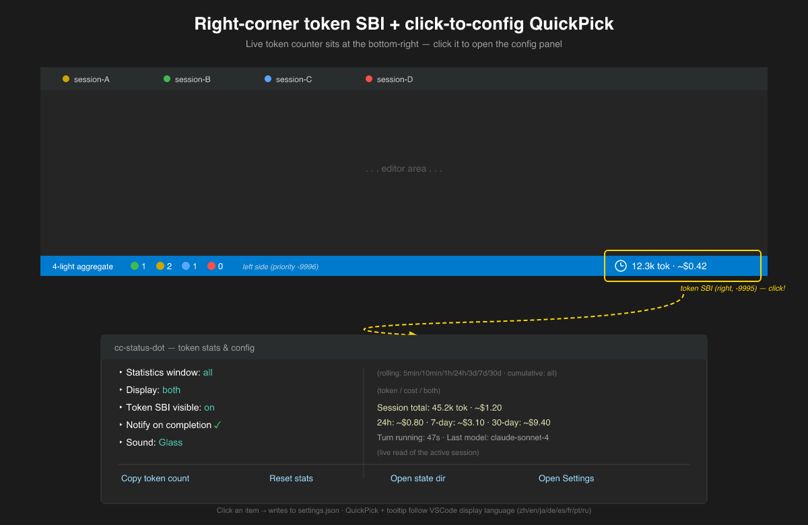

<div align="center">

# vscode-claude-code-status-dot

[](https://www.npmjs.com/package/vscode-claude-code-status-dot)
[](#license)
[](https://nodejs.org/)
[](#%EF%B8%8F-原理--ドキュメント)

**Claude Code のすべてのセッション状態を、タブとステータスバーでひと目で把握 —— タブをいちいち切り替えて確認する必要なし**

🟡 実行中 · 🟢 完了 · 🔵 入力待ち（CC が権限承認を要求、または CC の返信が「確認待ち / let me know」を含む）· 🔴 中断（速ブリンク）—— **タブ 5 状態ドット + 下部 4 ライト集計（🟢🟡🔵🔴、灰は含まない —— idle は下部集計外）+ 完了 / 中断通知 + CC 更新自動修復 + 右下トークンリアルタイム更新 / $ コスト推定（workflow サブエージェントのトークンも集計）+ QuickPick 設定パネルが VSCode 言語に追従（中 / 英 / 日 / 独 / 西 / 仏 / 葡 / 露）**

[简体中文](README.md) | [English](README.en.md) | [Deutsch](README.de.md) | [Español](README.es.md) | [Français](README.fr.md) | **日本語** | [Português](README.pt.md) | [Русский](README.ru.md)

</div>

---

> Claude Code を複数タブで同時に開いていると、どれが完了したのか、どれが権限承認を待っているのか、どれがレート制限で止まったのか —— タブを切り替えて確認するのが面倒。これをインストールすれば、**各タブが自ら状態を教えてくれ**、下部の 1 行で全会話の状況を俯瞰でき、完了 / 中断時にシステム通知を飛ばしてくれる。安心して別の作業に切り替えられる。

---

## 🖼️ プレビュー

<div align="center">


**上部タブバーと左上「開いているエディター（Open Editors）」に各セッションの状態ドットを表示**（🟡 実行中 / 🟢 完了 / 🔵 入力待ち / 🔴 中断 / ⚪ アイドル）

<br>


**セッション完了時の macOS システム通知 + サウンド**（フォアグラウンドでもバックグラウンドでも）

<br>



**右下のトークンリアルタイム計数 + クリックで立ち上がる設定パネル**——token SBI は現在アクティブなセッションの使用量とオプションの $ 推定を表示、**クリックすると** 統計ウィンドウ / 表示モード / 通知 / サウンドを切り替え、トークン数コピー / 統計リセット / 設定を開くことも可能（パネルは VSCode の UI 言語に追従）

<!-- 底部 4 ライト集計のスクリーンショット枠: ウィンドウ下部のステータスバー全体を 1 枚撮り、🟢done 🟡running 🔵pending 🔴interrupted + 数字の見え方を提示することを推奨。 -->

</div>

---

## 🚀 クイックスタート（約 30 秒）

**前提**: Node.js 18+ / Claude Code の VSCode 拡張がインストール済み

```bash
npx vscode-claude-code-status-dot
```

`Cmd+Shift+P`（Mac）/ `Ctrl+Shift+P`（Win/Linux）→ `Developer: Reload Window` → CC でプロンプトをひとつ送る。

タブアイコンが 🟡 **黄** に即変化、完了で 🟢 **緑** に変わって通知が鳴る；CC が権限承認を求めるとタブが 🔵 **青** に（reader が CC ネイティブ青ドットに譲る、**上書きしない**）、下部の 🔵 入力待ちライトが +1。**インストールするだけで動く、設定不要。**

> 通知をオフにしたい / サウンドを変えたいときだけ後述の[設定](#-設定任意)を参照。

> 標準に戻したいなら `npx vscode-claude-code-status-dot --revert`。

---

## 💬 何が得られるか

### 1. 各タブに 5 状態ドット

CC セッションのタブアイコンが状態に応じて変色 —— **上部タブバー + 左上「開いているエディター」の両方に表示**、完全に同期:

- 🟡 **黄** —— CC が処理中
- 🟢 **緑** —— 当ターンが正常に完了
- 🔵 **青** —— CC があなたを待っている（権限 / 質問 / elicit）
- 🔴 **赤（速ブリンク）** —— 中断 / レート制限
- ⚪ **灰** —— アイドル

「このタブ終わったっけ？」と毎回開いて確認する必要はもうない。

### 2. 下部 4 ライト集計：全会話の状況を一目で

ウィンドウ下部のステータスバーに 4 つのライト + 数字が 1 ブロックで常駐:

```
🟢 1   🟡 2   🔵 1   🔴 0
done    running  pending  interrupted
```

3 つのセッションが走っていて 2 つが承認待ちなら `🟡3 🔵2` と表示され、すぐに入力を要するセッションが 2 つあると分かる。**4 ライトの位置は固定**、数字が変わっても行はズレない（VSCode ステータスバーの `font-variant-numeric:tabular-nums` で数字等幅保証）。count=0 ではグレーアウトしてプレースホルダとして残る（灯かない）、count>0 でカラーボール点灯。

### 3. 完了 / 中断通知

CC が完了またはレート制限で中断したとき **システム通知** を飛ばす —— フォアグラウンドでもバックグラウンドでも:

- **macOS**：画面右上からドロップ、Glass サウンド、ボタンなし、数秒で自動消滅
- **Windows / Linux**：VSCode 右下の toast、ボタンなし

ブラウザや別ウィンドウに切り替えていても、完了時に自動的にお知らせ。見張り続ける必要はない。

通知をミュートする、無音にする、サウンドを変えることも可能 —— [設定](#-設定任意)を参照。

### 4. 🔵 入力待ち：CC が入力を求める瞬間に強調

下部 🔵 ライトが +1、タブが青に変わる、**2 種のトリガー**:

**(a) CC が権限承認ダイアログをポップアップ**（permission / question / elicit）—— タブ上で reader はアイコンを CC ネイティブ青ドットに譲る（**上書きしない**）、下部ステータスバーは独立して pending を計数。一目で入力を待っているセッションがいくつあるか分かる。

**(b) CC の最終返信が明確に「意思決定 / フィードバック待ち」**—— 例えば CC が最後に `テストフィードバック待ち`、`続けるかはあなたが決めて`、`let me know`、`your call`、`please confirm`、`Should I proceed?` などと言うとき、タブは自動的に青に転換（running 黄 / done 緑を上書き）。**「完了したのか、それとも返事を待っているのか」をタブを見て判別できる** —— ユーザーから最も要望の多かった高頻度ペイン（CC が完了と偽って実は入力待ち）を解消。

**中性完了 vs 入力待ちの判別**:

- 中性完了（`完了` / `Done.` / `Shipped.` / `すべてのテストが通過`）→ タブは 🟢 緑のまま
- 意思決定 / フィードバック待ち（中国語 `等你` / `你决定` / `请确认` / `告诉我` / `听你的`、英語 `let me know` / `your call` / `please confirm` / `what do you think` / `over to you`、または末尾の短い質問 `Should I proceed?` / `需要继续吗？`）→ タブは 🔵 青に転換

**誤発動しない**: コードブロック内の `letMeKnow()` などの識別子はマッチ前に剥離され；`Why?` / `什么意思?` / `効果如何?` などの修辞性 / 情報的疑問文はトリガーしない（CC の独り言で誤青にならない）。

### 4.5. 🪙 右下トークン / $ コスト

ステータスバー**右下**に 2 つ目の SBI を追加し、現在アクティブな CC panel のトークン使用量とオプションの USD 推定コストを表示:

```
$(clock) 12.3k tok · $0.42
```

- **CC のストリーミング出力に合わせてトークンがリアルタイム増加** —— 返信完了を待たず、各 tick で transcript 末尾を増分読み込み；tooltip は静的（点滅しない、最適化済み）。性能優先端末では `tokenLiveDeltaEnabled` で無効化可能
- **デフォルトウィンドウは `all`（累積、リセットなし）** —— 5min / 10min / 1h / 24h / 3d / 7d / 30d / all から選択可能。`all` はセッション全体の累積（会話レベルで単調増加、台帳のように増えるのみ減らない）；`5min..30d` はローリングウィンドウ（古い turn は期限切れで滑り落ちる、「リセットされた」ように見える、「最近 X 分 / 時間でどれくらい消費したか」を見るのに適する）
- **workflow サブエージェントのトークンも集計** —— バックグラウンドで spawn した subagent / teammate が消費したトークンは親セッションの統計に帰着。**あなたがそれらに支払ったコストが「見えなく」ならない**
- $ 推定は `token-rates.json` ホットリロード定価表で計算（Anthropic 公式価格をプリセット；GLM 等の未知モデルは自動的に $ を隠しトークンのみ表示）
- tooltip には現在のセッションの total / 24h / 7d / 30d 累計 $ + モデル + プロジェクト + 今 turn の経過時間を表示
- SBI をクリックすると QuickPick 設定パネルが開く: ウィンドウ切替 / 表示モード（token / cost / both）/ 通知オンオフ / サウンド選択 / トークン数コピー / 統計リセット / 状態ディレクトリを開く / 設定を開く
- **QuickPick 設定パネル + tooltip は VSCode の UI 言語に追従**（zh / en / ja / de / es / fr / pt / ru、未知の言語は en にフォールバック）—— VSCode が日本語ならパネルも日本語；設定値（5min / all / token / cost / both / サウンド名）は言語中立で翻訳されない
- しきい値アラート: `ccStatusDot.warnThresholdUsd` が閾値を跨いだとき通知（デフォルト無効）

**データソース**: CC の transcript jsonl が唯一の権威ソース（各行の assistant `message.usage`）。writer hook は byte-offset sidecar で増分読み取り（33MB の大ファイルでも < 100ms）。CC `/resume` は同一 sid を再利用 → 統計は自然に継続；新規セッションは 0 から開始。

詳しくは [USAGE.md §3.6](docs/USAGE.md) および [STATES.md §8](docs/STATES.md) を参照。

### 5. companion 自愈：CC 更新で自動復元

CC の自動更新はパッチを全体上書きしてしまう。**v0.2.0 より**、`npx` インストール時に **companion 拡張** を VSCode 系エディタ（Insiders / Cursor / VSCodium 含む）に自動インストール；次回 VSCode 起動時に companion がパッチの消失を検出、**自動で patcher を再実行 + 1 クリックの Reload Window を提案** —— 多くの場合ユーザーは何もしなくてよい、無感で復元される。

### 6. 持続性：ソース削除 / キャッシュクリア / CC 更新でも影響なし

ランタイム copy は `~/.claude/cc-status-dot/`（SVG アイコン + hook スクリプト + patcher）に置かれる。すべての hook コマンドとアイコンパスはこの**絶対パス**を指す —— プロジェクトソースを削除、npx キャッシュをクリア、CC が自動更新してもここには触れない、patched 済み拡張は正常にレンダリングを続ける。

### 7. workflow 実行中は誤緑なし

バックグラウンドで subagent / cron が走っているとき、メインセッションのタブは **黄色のまま**（誤って完了と表示されない）—— `Stop` hook はペイロードの `background_tasks` カウントのみを信頼し、ドリフトしない。実際に仕事が終わったときだけ緑に転換する。

### 8. 安全設計（CC を絶対にレンガ化しない）

`extension.js` 書き込み前に完全な 2.6MB ファイルに対して `node --check` を実行（assertCompiles 守衛、壊れた注入は拒絶）、原子書き込み（`.tmp` + rename）、`INJECT_VERSION` 自動再注入。たとえ patcher がエラーを出しても、**CC 拡張を破壊することはない**。

### 9. ワンクリックで副作用なく復元

`npx vscode-claude-code-status-dot --revert` が `.bak` から `extension.js` を完全復元、hook を外科的に取り除き、**ユーザーデータはすべて保持**する。

> ⚠️ **誠実な声明**: これは **patch（パッチ）** であり、独立した拡張ではありません —— VSCode はサードパーティ拡張が別の拡張の webview タブアイコンを変更することを許可しない、唯一の現実的経路が CC 自身の `extension.js` にパッチすること。代償: CC の自動更新で上書きされるが、companion 自愈拡張が自動的に復元する（セクション 5 参照）。

---

## 🎨 状態色

| 色 | 意味 | トリガー |
|---|---|---|
| 🟡 黄 `#CCA700`（**静的**、アニメなし） | 実行中 | プロンプト送信、ツール呼び出し前後（ハートビート）、subagent spawn |
| 🟢 緑 `#3FB950`（静的） | 当ターン完了（ユーザー入力不要） | CC が `Stop` をトリガー、かつ最終返信が中性完了（`完了` / `Done.` / `すべてのテストが通過`）；**5 分超過で自動的に灰に** |
| 🔴 赤 `#F85149`（速ブリンク） | 中断 / エラー | CC が `StopFailure` をトリガー（レート制限、過負荷など） |
| ⚪ 灰 `#808080`（静的） | アイドル | 初期 / 完了から 5 分超過 / ステータスファイルなし |
| 🔵 青 `#58A6FF`（静的） | ユーザー入力待ち（2 種のトリガー） | (a) **CC が権限承認ダイアログをポップアップ**: reader がアイコンを譲り、CC ネイティブの青ドットを表示（**上書きしない**）；(b) **CC の最終返信が「意思決定待ち」の意味を含む**（`等你` / `你决定` / `请确认` / `let me know` / `your call` など）→ reader が青色 `claude-logo-pending.svg` をレンダリング（running 黄 / done 緑を上書き）。下部 🔵 ライトは両トリガーを計数 |

> running は静的黄ドット（アニメなし）；interrupted は赤の速ブリンクで警告。完全な状態契約（イベント / SVG / IPC / 通知）は [`docs/STATES.md`](docs/STATES.md) を参照。

---

## 🛠️ 機能詳細

### 🟡 5 状態タブアイコンドット

各 CC セッションのタブアイコンが状態に応じて変色、**上部タブバーと左上の「開いているエディター」ビューの両方に表示**。running / done / idle は静的ドット、interrupted は赤の速ブリンクで警告、CC が権限承認ダイアログを表示するときは reader がアイコンを譲って CC ネイティブの青ドットを表示（**上書きしない**）。

### 📊 下部ステータスバー 4 ライト集計

ウィンドウ下部のステータスバー（左半分・中央寄り）に **1 個のまとまり（単一 StatusBarItem + `parts.join(' ')` スペース連結）** を表示。4 つのライトを小さなスペースで区切って 1 行に並べる:

`🟢3 🟡1 🔵0 🔴0`

- 🟢 **完了** — 当ターン正常終了したセッション（done >5 分で idle に転換、緑から減る）
- 🟡 **実行中** — プロンプト送信〜ツール呼び出し中のセッション
- 🔵 **入力待ち** — ユーザー入力を待っているセッション。**2 種のトリガーを計数**: (a) CC が権限承認 / question / elicit を要求（`Notification` hook が `pending:true` を書き込み）；(b) CC の返信が「意思決定待ち」の意味を含む（`Stop` hook が最終返信を読み `等你` / `let me know` / `your call` などのキーワードに命中時に `pending:true` を書き込み）。**下部集計は 2 ソース計数** —— CC リアルタイム pending フラグ（同一ウィンドウ内で同期）+ 落ちた `<sid>.json.pending`（ウィンドウ跨ぎ非同期）、権限ダイアログが出た瞬間から点灯、取りこぼさない
- 🔴 **中断** — レート制限 / 過負荷などで中断したセッション

各ライトは直後に数字（0/1/2/3/N、N=4+ で頭打ち）を伴う。count=0 → グレーボール ⚪ + 数字（グレーアウト）、count>0 → カラーボール + 数字（点灯）。**4 ライトの位置は固定**、数字が変化してもズレない（VSCode ステータスバーの `font-variant-numeric:tabular-nums` により ASCII 数字 0-9 は等幅保証）。

会計の健全性を保つための **3 段 GC**: 完了 >5 分 → idle（緑 −1）/ running が 30 分以上更新されず → idle（クラッシュ会話の回収）/ interrupted が 24 時間以上 → idle。pending は st フィールドに基づき GC（クラッシュした pending → idle、黄 + 青を減らす）。

ブロック全体は **1 つのランタイム StatusBarItem + text 連結**（IIFE が 500ms ごとに SBI の text を直接 mutate）で実現 —— CC の `package.json` にパッチ不要、ThemeColor ブロックも不要。

### 🔔 完了 / 中断通知

セッションが `done` または `interrupted` に転換したとき（状態転換のその一瞬のみ、繰り返さない）:

- **macOS**: 画面右上からドロップするシステム通知をポップアップ（デフォルトサウンド `Glass`）。ボタンなし、数秒で自動消滅。`notifyWhenFocused` がデフォルト `true` なので、フォアグラウンドでもバックグラウンドでも通知。macOS では初回システム通知で「Script Editor が通知を送信したい」認証を一度ポップアップ、許可すれば OK。
- **Windows / Linux**: `osascript` がないため VSCode 内蔵メッセージ（右下 toast、ボタンなし、自動消滅）にフォールバック。

done と中断はどちらも `ccStatusDot.notifySound`（デフォルト `Glass`）を再生。

### 🛡️ companion 自愈拡張（v0.2.0+）

`npx` インストール時に PATH 上の VSCode 系 CLI（`code` / `code-insiders` / `cursor` / `codium`）を検出し、それぞれに **companion .vsix**（`cc-status-dot-companion`）を `code --install-extension` でインストール；同時に `patch.js` を `~/.claude/cc-status-dot/patch.js` にコピー。

VSCode 起動ごとに、companion 拡張は CC 拡張内の `cc-status-dot-injected` マーカをチェック —— CC 自動更新でパッチが消えていたら（マーカが見つからなければ）、companion は自動で `node ~/.claude/cc-status-dot/patch.js` を再実行し、1 クリックの `Reload Window` を提案する。**ユーザーは無感で復元**、手動で `npx` を再実行する必要はない。

### ⚙️ workflow 実行中は running を維持

バックグラウンドで workflow / subagent が動いているとき、メインセッションは **黄のまま**（誤って緑に表示されない）。`Stop` はペイロードの `background_tasks` カウントのみを信頼し、退化ドリフトを出さない。実際に仕事が終わったときだけ緑に転換する。

### 📂 Open Editors 同期

左上の「開いているエディター」ビューの CC タブ **も状態ドットを表示**、上部タブバーと完全に同期。

### 🔒 持続性機構

reader（注入 IIFE）が参照する SVG パスと、settings.json に接続された hook コマンドは、どちらも `~/.claude/cc-status-dot/`（`INSTALL_DIR`）の**絶対パス**を指す。プロジェクトのソースディレクトリではない。インストール時に patcher がプロジェクトソース（`resources/` + `hooks/`）から冪等的にコピーする。なので以下のいずれでも:

- プロジェクトのソースディレクトリを削除
- npx キャッシュがクリアされる
- CC が自動更新（拡張ディレクトリのみ上書き、`~/.claude/` には触れない）

patched 済み拡張は正常に描画し続ける。

### ↩️ ゼロ副作用・ワンクリック復元

`npx vscode-claude-code-status-dot --revert` が `.bak` から `extension.js` を完全復元、**9 つの管理対象 hook** を外科的に取り除き（`~/.claude/settings.json` 内の `# cc-status-dot-managed` タグ付き、🔵 入力待ちライトを支える Notification hook を含む）、ユーザーデータはすべて保持する。

<details>
<summary>📖 コマンド一覧</summary>

| コマンド | 役割 |
|---|---|
| `npx vscode-claude-code-status-dot` | インストール（パッチ + hooks + companion、冪等；旧版の残留も自動クリーンアップ） |
| `npx vscode-claude-code-status-dot --revert` | 復元（`.bak` から復元 + hooks 削除 + INSTALL_DIR 削除、ユーザーデータは保持） |
| `npx vscode-claude-code-status-dot --status` | dry-run 診断レポート、ファイルを一切変更しない |

開発時はコマンドを `npx tsx patch.ts` に置き換える（同じ引数）。

またはソースから（開発時）:
```bash
git clone https://github.com/wangdong233/vscode-claude-code-status-dot.git
cd vscode-claude-code-status-dot
npx tsx patch.ts
```

両パスは等価・冪等。IIFE と hook はどちらも `INSTALL_DIR` 絶対パスを参照する —— **プロジェクトソースを削除 / npx キャッシュをクリアしても patched 済み拡張には影響しない**。

</details>

<details>
<summary>📖 アップグレードパス（旧版 git clone インストールからの移行）</summary>

旧版ユーザーはそのまま `npx vscode-claude-code-status-dot` を再実行すればよい：patcher が旧版の注入ロジックを検出 → 自動的にオリジナルを復元 → 新版を再注入、**`--revert` は不要**。

</details>

<details>
<summary>📖 なぜ patch なのか（独立した拡張ではない理由）</summary>

VSCode の `WebviewPanel` タブアイコン（`iconPath`）は**その panel を生成した拡張が独占的に設定**する。サードパーティ拡張がそれを変更する公開 API は存在しない。CC の session タブはまさに CC 拡張自身が生成した WebviewPanel で、そのアイコンは CC の `extension.js` 内部でしか代入できない。代替案（独立拡張、proposed API、webview インターセプトなど）をすべて尽了くしたが到達不能、唯一の現実的経路が patch。代償：CC の自動更新で上書きされる（v0.2.0 より companion 自愈拡張が自動復元）。

</details>

---

## ⚙️ 設定（任意）

**設定変更の 2 つの方法**:

1. **右下の token SBI をクリック** → QuickPick 設定パネルが立ち上がる（上記「🖼️ プレビュー」のスクリーンショット参照）——グラフィカルに統計ウィンドウ / 表示モード / 通知 / サウンドを切り替え、トークン数コピー / 統計リセット / 状態ディレクトリを開く / 設定を開くことも可能。変更は自動的に `settings.json` に書き込まれ、パネルは VSCode の UI 言語に追従（中 / 英 / 日 / 独 / 西 / 仏 / 葡 / 露、未知の言語は en にフォールバック）。
2. **直接 `settings.json` を編集**（下記テーブル）—— 一括設定やバージョン管理に適する。

VSCode の `settings.json` に書く（設定しなければデフォルト値）:

```json
{
  "ccStatusDot.notify": true,
  "ccStatusDot.notifyWhenFocused": true,
  "ccStatusDot.notifySound": "Glass",

  "ccStatusDot.tokenStatsWindow": "all",
  "ccStatusDot.tokenDisplayMode": "both",
  "ccStatusDot.tokenSbiVisible": true,
  "ccStatusDot.tokenLiveDeltaEnabled": true,
  "ccStatusDot.showCost": true,
  "ccStatusDot.warnThresholdUsd": 0
}
```

| 設定項目 | デフォルト | 説明 |
|---|---|---|
| `ccStatusDot.notify` | `true` | 通知のメインスイッチ |
| `ccStatusDot.notifyWhenFocused` | `true` | フォアグラウンド（VSCode がアクティブ）でも通知（macOS システム通知 / Win / Linux は VSCode メッセージ）；`false` でバックグラウンド時のみ通知 |
| `ccStatusDot.notifySound` | `"Glass"` | macOS システム通知サウンド（done と中断で共有；`""` でミュート；Basso / Ping / Hero なども選択可） |
| `ccStatusDot.tokenStatsWindow` | `"all"` | 右下トークン SBI の時間ウィンドウ。`all` = 累積（セッション全体、リセットなし、デフォルト）；`5min/10min/1h/24h/3d/7d/30d` = ローリングウィンドウ（古い turn は期限切れで滑り落ちる、「リセットされた」ように見える） |
| `ccStatusDot.tokenDisplayMode` | `"both"` | トークン SBI の表示モード: `token`（トークンのみ）/ `cost`（$ のみ）/ `both`（両方） |
| `ccStatusDot.tokenSbiVisible` | `true` | トークン SBI の表示 / 非表示 |
| `ccStatusDot.tokenLiveDeltaEnabled` | `true` | ストリーミング中 IIFE が tick ごとに transcript 末尾を読み、hook 発火間でもトークンが更新される；性能優先端末では `false` で無効化 |
| `ccStatusDot.showCost` | `true` | `$` を表示（未知モデルは自動的に非表示；`token-rates.json` に一致エントリが必要） |
| `ccStatusDot.warnThresholdUsd` | `0` | コスト閾値越え通知（0 = 無効；正数 = USD 閾値、越えるごとに 1 回通知） |

> **カスタムモデル定価**: `~/.claude/cc-status-dot/token-rates.json` はホットリロード定価表 —— デフォルトで Anthropic 公式価格をカバー；GLM 等の未一致モデルは自動的に $ を隠す。glob を 1 行追加すれば $ 表示を有効化できる:

```jsonc
{
  "_default": null,
  "claude-sonnet-*": { "in": 3, "out": 15, "cacheRead": 0.3, "cacheCreate5m": 3.75, "cacheCreate1h": 6 },
  "glm-*":           { "in": 0.5, "out": 1.5 }
}
```

---

## ❓ FAQ

**CC 更新後に状態ドットが点かない?**
CC の自動更新が拡張ディレクトリを全体置換し、patched ファイルがオリジナルで上書きされるため。companion 拡張が VSCode 起動時に `cc-status-dot-injected` マーカの消失を検出し、自動で `node ~/.claude/cc-status-dot/patch.js` を再実行して 1 クリックの `Reload Window` を提案 —— 多くの場合、ユーザーは何もしなくてよい。companion が未インストール（または手動修復したい）場合は `npx vscode-claude-code-status-dot` を再実行（SVG / hook のランタイムコピーは `~/.claude/cc-status-dot/` にあり、CC 更新は触れない；プロジェクトのソースを削除しても影響しない）。

**インストール直後にアイコンが変わらない?**
まず `Developer: Reload Window`。それでもダメなら `npx vscode-claude-code-status-dot --status` を実行: `patched: no` は再実行；`baked RES ... (STALE)` は再実行でその場で書き換え；`hooks wired: no` は再実行；`missing SVGs` は再実行で補完。

**旧版（git clone インストール）からアップグレード?**
そのまま `npx vscode-claude-code-status-dot` を再実行 —— 旧版のアップグレードを自動処理、`--revert` 後の再インストールは不要。

**状態が running のまま固まる?**
多くの場合 Esc で CC を中断したのが原因（CC は Stop / StopFailure をトリガーしない、hook なし）。次回プロンプト送信時か正常完了時に自然に修正される。

**`npx` で接続できない?**
フォールバックとしてグローバルインストール:
```bash
npm i -g vscode-claude-code-status-dot
vscode-claude-code-status-dot        # インストール後そのままコマンド実行
```

---

## ⚠️ 既知の制限

- **手動 Esc 中断には hook がない**: CC は Stop / StopFailure をトリガーしない（[#45289](https://github.com/anthropics/claude-code/issues/45289) / [#9516](https://github.com/anthropics/claude-code/issues/9516)）、状態は running で止まり、次回プロンプト / Stop で自然修正される。
- **CC 自動更新で上書き**: patched `extension.js` がオリジナルで上書き → **companion 拡張が自動で patcher を再実行 + reload を提案**（FAQ 参照）；companion がない場合は手動でコマンドを再実行して復元。
- **minified anchor の脆さ**: patch は CC コードの 2 箇所の正確な文字列に依存。バージョンずれが生じると patcher は "Anchor mismatch" を報告して書き込みを拒否。書き込み前には完全な 2.6MB ファイルに対して `node --check` を実行（assertCompiles 守衛、壊れた IIFE は拒絶）、原子書き込み（`.tmp` + rename）、`INJECT_VERSION` 自動再注入 —— **CC を絶対にレンガ化しない**。
- **VSCode 完全終了時は通知しない**: IIFE は拡張ホストプロセスで動く、VSCode 終了時には動かない → 通知しない。
- **システム通知のクリックでタブに飛ばない**: osascript に click callback がなく、通知はリマインドのみ。VSCode に戻ってから tab の緑 / 赤ドットで位置を特定。
- **SBI priority に所有権がない**: 下部ステータスバーのブロックは `StatusBarAlignment.Left` の priority `-9996`（単一ポイント）を占める。VSCode StatusBarItem API には拡張レベルの名前空間 / 所有権機構がないため、他の拡張が同じ priority を宣言すると SBI が隅に押しやられる可能性がある。**単一 SBI ブロックのアーキテクチャにより「行が外部に分割される」失敗モードを排除**（4 つの独立 SBI だと他拡張の SBI がライト間に割り込み分割する；行全体を 1 个の SBI にすれば外部挿入は行の両端にしか落ちず、4 ライトは分割されない）。主流のユースケースでは発火せず、STATES.md §7.5 にこの制限を誠実に記載している。
- **emoji フォントスタック依存**: 下部ステータスバーのドットは emoji グリフ（🟢🟡🔵🔴⚪）で、システムの emoji フォントスタックに依存する —— macOS（Apple Color Emoji）/ Windows 10+（Segoe UI Emoji）/ 主要 Linux（Noto Color Emoji）では正常にカラー表示；Win7 / 一部 headless Linux / emoji フォントのないリモート SSH 環境では白黒グリフや豆腐块にレンダリングされる可能性がある。これは意図的な審美的トレードオフ（ドット emoji > クロスプラットフォームで一貫する色块）。

---

## 🏗️ 原理 + ドキュメント

**CC の extension.js にパッチ（タイマーを注入してタブアイコンを設定）+ CC hooks が状態を書き込み + 完了 / 中断通知。** 完全なドキュメント:

- [`docs/STATES.md`](docs/STATES.md) —— **状態契約（唯一の真実源）**: 5 状態（灰 / 黄 / 緑 / 赤 / 青） / 下部 4 ライト集計 / イベントマッピング / IPC / 通知
- [`docs/DESIGN-injection.md`](docs/DESIGN-injection.md) —— アイコン注入の原理（anchor / IIFE / SVG バインディング）
- [`docs/USAGE.md`](docs/USAGE.md) —— 使用ガイド（インストール / トラブルシューティング / 復元）

> 本プロジェクトは CC 拡張の `extension.js` を変更し（バックアップ済み、`--revert` で完全復元）、`~/.claude/settings.json` に書き込む（初回バックアップ）。hook スクリプトは**決して CC をブロック / 中断しない**設計 —— いかなるエラーもサイレントに終了。**9 つの hooks**（`Notification` 落ち pending を含む）。

---

## 💝 作者を支援する

vscode-claude-code-status-dot がお役に立てば、作者にコーヒーをおごっていただけると嬉しいです ☕

<div align="center">

WeChat | Alipay
:-: | :-:
 | 


</div>

または ⭐ Star、Issue / PR の提出 —— どれも作者へのサポートです。

## License

[MIT](LICENSE) (c) wangdong
