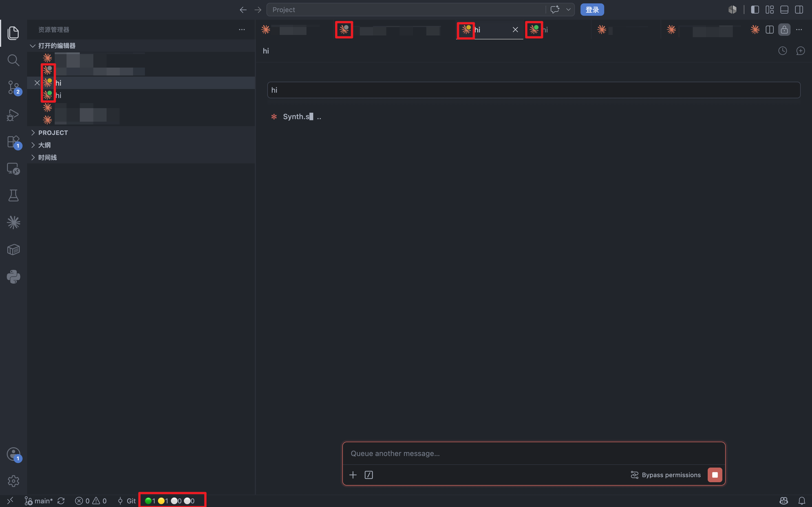
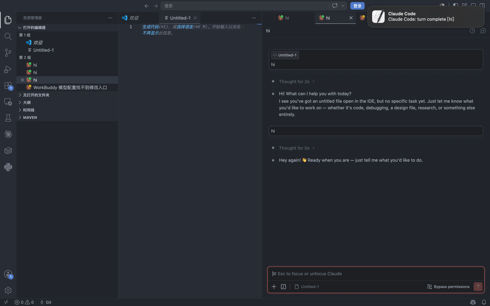

<div align="center">

# vscode-claude-code-status-dot

[](https://www.npmjs.com/package/vscode-claude-code-status-dot)
[](#license)
[](https://nodejs.org/)
[](#-arquitetura--documentação)

**Veja num relance o estado de todas as suas sessões do Claude Code — sem precisar ficar alternando abas.**

🟡 Em execução · 🟢 Concluído · 🔴 Interrompido (piscando rápido) · ⚪ Ocioso · 🔵 Aguardando você

[简体中文](README.md) | [English](README.en.md) | [Deutsch](README.de.md) | [Español](README.es.md) | [Français](README.fr.md) | [日本語](README.ja.md) | **Português** | [Русский](README.ru.md)

</div>

---

> Cada sessão do Claude Code ganha um **ponto colorido na aba** (amarelo / verde / vermelho / cinza) — tanto na barra de abas do topo quanto na vista "Open Editors". Além disso, a **barra de status inferior agrega tudo num único bloco de 4 luzes 🟢🟡🔵🔴 com contagem**, para ver **todas** as sessões de uma vez. E você ainda recebe **notificações do sistema** quando o CC termina ou é interrompido.

<div align="center">



*Pontos de estado nas abas do topo e em "Open Editors" — amarelo em execução, verde concluído, vermelho interrompido*

<br>



*Notificação do sistema + som quando a sessão termina*


</div>

---

## 🚀 Comece em 30 segundos

```bash
npx vscode-claude-code-status-dot
```

Depois, no VSCode: `Cmd+Shift+P` (Mac) / `Ctrl+Shift+P` (Win/Linux) → digite `Developer: Reload Window`.

Pronto. Envie um prompt no Claude Code e observe o ponto da aba mudar de cor.

<details>
<summary>Pré-requisitos e instalação alternativa</summary>

- **Node.js 18+**
- **Extensão VSCode do Claude Code instalada** (você consegue abrir o painel de chat do CC dentro do VSCode)

A partir do código-fonte (modo dev):
```bash
git clone https://github.com/wangdong233/vscode-claude-code-status-dot.git
cd vscode-claude-code-status-dot
npx tsx patch.ts
```
Os dois caminhos são equivalentes e idempotentes — pode rodar de novo quantas vezes quiser.

</details>

---

## 💬 O que você ganha?

**Ver o estado de cada sessão sem precisar clicar nela.** Enquanto o Claude Code trabalha, a cor do ponto da aba muda sozinha — e a barra de status inferior agrega tudo num só bloco.

| Situação | O que você vê |
|---|---|
| Você envia um prompt | 🟡 A aba da sessão fica **amarela** — está rodando |
| O CC termina normalmente | 🟢 A aba fica **verde** + notificação do sistema (macOS) ou toast (Win/Linux) |
| O CC é interrompido por rate limit / overload | 🔴 A aba **pisca vermelho rápido** + notificação trazendo o motivo |
| Workflow / subagent ainda rodando em segundo plano | A aba principal **continua amarela** (não fica verde falsamente); `Stop` é a autoridade final |
| CC pede permissão / pergunta / elicit | 🔵 Aparece como **pendente** na barra inferior (contador +1) + ponto azul nativo do CC |
| Quer ver tudo de uma vez? | Olhe a **barra de status inferior**: 🟢🟡🔵🔴 com contagem, lado a lado, posições fixas |
| O CC atualiza e quebra o patch? | A **extensão companion** se autocura na próxima inicialização do VSCode — você quase nem percebe |

> **Tudo funciona logo após a instalação — sem configurar nada.** Só vá nas configurações se quiser desligar notificações ou trocar o som.

---

## 🎨 Cores de estado

| Cor | Significado | Quando aparece |
|---|---|---|
| 🟡 Amarelo `#CCA700` (estático, sem animação) | Em execução | Envio de prompt, antes/depois de chamada de ferramenta (heartbeat), spawn de subagent |
| 🟢 Verde `#3FB950` (estático) | Rodada concluída | O CC dispara `Stop` (**após 5 minutos vira cinza automaticamente**) |
| 🔴 Vermelho `#F85149` (pisca rápido) | Interrompido / erro | O CC dispara `StopFailure` (rate limit, overload etc.) |
| ⚪ Cinza `#808080` (estático) | Ocioso | Inicial / concluído há mais de 5 minutos / sem arquivo de estado |
| 🔵 Azul (nativo do CC) | Aguardando autorização | Ponto azul nativo do CC, **este projeto não sobrescreve** |

> Em execução é amarelo estático (sem piscar); interrompido mantém o pisca rápido de alerta. O contrato completo de estados está em [`docs/STATES.md`](docs/STATES.md).

---

## ✨ Recursos

- **📍 Ponto de estado de 4 cores em cada aba** — visível simultaneamente na barra de abas do topo e em "Open Editors". idle/running/done são estáticos; interrupted pisca vermelho rápido.
- **📊 Bloco de 4 luzes agregadas na barra de status inferior** — 🟢concluído · 🟡correndo · 🔵pendente · 🔴interrompido, cada uma com sua contagem ao lado. As 4 posições são fixas — os dígitos mudam sem deslocar as luzes. Veja **todas** as sessões num único olhar.
- **🔵 Pending = aguardando você** — sempre que o CC pede permissão / pergunta / elicit, a luz azul acende e o contador soma +1 (alimentado pelo hook `Notification`, independente do estado da sessão).
- **🔔 Notificações de conclusão / interrupção** — macOS: notificação do sistema (canto superior direito, som `Glass`, sem botões, some sozinha), em primeiro ou segundo plano. Windows / Linux: toast embutido do VSCode.
- **🛡️ Companion que se autocura (v0.2.0+)** — quando o CC atualiza e sobrescreve o patch, a extensão companion detecta na inicialização do VSCode, re-aplica o patch automaticamente e sugere reload. **Você não precisa fazer nada.**
- **♻️ Persistente** — runtime em `~/.claude/cc-status-dot/`. Apagar o código-fonte, limpar o cache do npx, ou uma atualização do CC: a extensão já patcheada continua funcionando.
- **🔒 Seguro contra quebra do CC** — `assertCompiles` valida o código com `node --check` antes de escrever; IIFE inválido é recusado, escrita atômica, `INJECT_VERSION` reinjeta automaticamente. **Nunca quebra o CC.**
- **⚙️ Mantém running enquanto o workflow roda** — subagent / cron em segundo plano não deixa a sessão verde falsamente; `Stop` é a autoridade final.
- **🪝 9 hooks (incluindo `Notification`)** — gravam o estado da sessão em arquivo; o leitor de ícones reage em tempo real.
- **↩️ Restauração sem danos** — `--revert` restaura tudo a partir do `.bak`, remove os hooks cirurgicamente e preserva seus dados de usuário.

---

## ⚙️ Configuração (opcional)

Tudo funciona sem configurar nada. Se quiser ajustar, escreva no `settings.json` do VSCode:

```json
{
  "ccStatusDot.notify": true,
  "ccStatusDot.notifyWhenFocused": true,
  "ccStatusDot.notifySound": "Glass"
}
```

| Opção | Padrão | Descrição |
|---|---|---|
| `ccStatusDot.notify` | `true` | Chave geral das notificações |
| `ccStatusDot.notifyWhenFocused` | `true` | Também notifica quando o VSCode está em primeiro plano (`false` = apenas em segundo plano) |
| `ccStatusDot.notifySound` | `"Glass"` | Som da notificação macOS (compartilhado entre done e interrupção; `""` = silencioso; opções: Basso / Ping / Hero etc.) |

---

## 🧰 Comandos

| Comando | Função |
|---|---|
| `npx vscode-claude-code-status-dot` | Instala (idempotente; limpa resíduos de versões antigas automaticamente) |
| `npx vscode-claude-code-status-dot --revert` | Restaura tudo (recupera do `.bak`, remove os hooks, apaga o `INSTALL_DIR`, preserva seus dados) |
| `npx vscode-claude-code-status-dot --status` | Diagnóstico dry-run, não altera nenhum arquivo |

> Em modo dev, troque o comando por `npx tsx patch.ts` (mesmos parâmetros).

---

## ❓ FAQ

**Depois de atualizar o CC o ponto de estado sumiu?**
Desde a v0.2.0, a extensão companion checa o marcador `cc-status-dot-injected` na inicialização do VSCode e, se o CC tiver sobrescrito o patch, re-aplica automaticamente `node ~/.claude/cc-status-dot/patch.js` + sugere `Reload Window` num clique — na maioria das vezes você nem percebe. Sem o companion (ou se preferir reparar manualmente): rode `npx vscode-claude-code-status-dot` de novo — a cópia de runtime em `~/.claude/cc-status-dot/` não é tocada pela atualização do CC.

**Acabei de instalar e o ícone não mudou?**
Primeiro faça `Developer: Reload Window`. Se ainda não funcionar, rode `npx vscode-claude-code-status-dot --status`: se aparecer `patched: no`, rode o install de novo; se `baked RES ... (STALE)`, rode de novo para reescrever no local; se `hooks wired: no`, rode de novo; se `missing SVGs`, rode de novo para completar.

**Upgrade da versão antiga (instalada via git clone)?**
Rode `npx vscode-claude-code-status-dot` diretamente — o upgrade da versão antiga é tratado automaticamente, sem precisar fazer `--revert` antes de reinstalar.

**Estado travado em running?**
Provavelmente você interrompeu o CC com Esc (o CC não dispara Stop/StopFailure, sem hook). O estado se corrige sozinho no próximo prompt ou numa conclusão normal.

**`npx` não conecta?**
Plano B — instalação global:
```bash
npm i -g vscode-claude-code-status-dot
vscode-claude-code-status-dot        # depois de instalar, rode o comando direto
```

---

## ⚠️ Limitações conhecidas

- **Interrupção manual via Esc não tem hook**: o CC não dispara Stop/StopFailure ([#45289](https://github.com/anthropics/claude-code/issues/45289) / [#9516](https://github.com/anthropics/claude-code/issues/9516)); o estado fica em running e se corrige no próximo prompt.
- **Atualização automática do CC sobrescreve** o `extension.js` patcheado → **desde v0.2.0 a extensão companion re-aplica o patch automaticamente + sugere reload** (ver FAQ); sem o companion, rode o comando manualmente.
- **Fragilidade da âncora minificada**: o patch depende de duas strings precisas no código do CC; em caso de divergência de versão o patcher devolve "Anchor mismatch" e se recusa a escrever (a extensão não é corrompida).
- **Sem notificação quando o VSCode está totalmente fechado**: o IIFE roda no processo host da extensão; VSCode fechado → sem notificação.
- **Clique na notificação do sistema não salta para a aba**: o `osascript` não tem callback de clique; a notificação é apenas um lembrete — use o ponto verde/vermelho da aba como referência para voltar ao VSCode.

---

## 🏗️ Arquitetura + documentação

<details>
<summary>📖 Por que é um patch (e não uma extensão independente)?</summary>

O ícone da aba de `WebviewPanel` do VSCode (`iconPath`) é definido **exclusivamente pela extensão que cria o painel** — não há API pública que permita a uma extensão de terceiros alterá-lo. A aba de sessão do CC é exatamente um WebviewPanel criado pela própria extensão do CC, e seu ícone só pode ser atribuído dentro do `extension.js` do CC. Alternativas exaustivamente consideradas (extensão independente, proposed API, interceptação de webview etc.) são todas inviáveis; o único caminho viável é o patch. O custo: atualizações automáticas do CC sobrescrevem — e é exatamente isso que a **companion v0.2.0+ resolve automaticamente**.

</details>

<details>
<summary>📖 Como funciona (resumo técnico)</summary>

- **Patch no `extension.js` do CC** — injeta um temporizador (IIFE) que define o `iconPath` da aba e dispara as notificações done/interrupted.
- **9 hooks do CC** — gravam o estado da sessão em arquivo; o `Notification` alimenta o contador de pending de forma independente do estado.
- **Runtime em `~/.claude/cc-status-dot/`** — 4 SVGs (idle + running + done + error) + script de hook + `patch.js` para a companion re-aplicar.
- **Barra de status inferior** — 1 único `StatusBarItem` (`StatusBarAlignment.Left`, prioridade `-9996`) renderiza o bloco de 4 luzes; o IIFE atualiza o texto concatenado a cada 500ms, com `font-variant-numeric: tabular-nums` nativo do VSCode para garantir que as posições não deslocam quando os dígitos mudam.
- **assertCompiles** — `node --check` valida o IIFE antes de escrever; IIFE inválido é recusado e a extensão original não é tocada. Escrita atômica + `INJECT_VERSION` permite reinjeção automática em upgrades.
- **Companion .vsix** — instalada em cada CLI da família VSCode no PATH (`code`, `code-insiders`, `cursor`, `codium`); detecta sobreescrita na inicialização e re-aplica o patch + sugere reload.

</details>

Documentação completa:

- [`docs/STATES.md`](docs/STATES.md) — **Contrato de estados (fonte única de verdade)**: quatro estados / mapeamento de eventos / IPC / notificações
- [`docs/DESIGN-injection.md`](docs/DESIGN-injection.md) — Princípio da injeção do ícone (âncora / IIFE / associação de SVG)
- [`docs/USAGE.md`](docs/USAGE.md) — Guia de uso (instalação / troubleshooting / restauração)

> Este projeto modifica o `extension.js` da extensão do CC (com backup; `--revert` restaura totalmente) e escreve em `~/.claude/settings.json` (backup na primeira vez). Os scripts de hook são projetados para **nunca bloquear ou interromper o CC** — qualquer erro sai silenciosamente com `exit(0)`.

---

## 💝 Apoie o autor

Se o vscode-claude-code-status-dot te ajudou, considere pagar um café para o autor ☕

<div align="center">

WeChat | Alipay
:-: | :-:
 | 

</div>

Ou ⭐ Star, abrir uma Issue / PR — também são formas de apoiar o autor.

## License

[MIT](LICENSE) (c) wangdong
