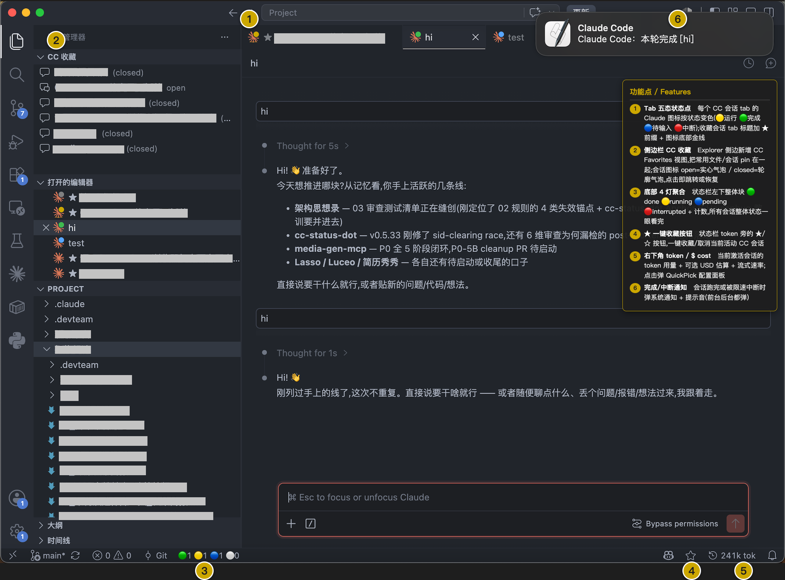

<div align="center">

# vscode-claude-code-status-dot

[](https://www.npmjs.com/package/vscode-claude-code-status-dot)
[](#license)
[](https://nodejs.org/)
[](#-arquitetura--documentação)

**Veja num relance o que todas as sessões do Claude Code estão fazendo — sem precisar ficar alternando abas**

🟡 Em execução · 🟢 Concluído · 🔵 Aguardando você (o CC abriu a caixa de autorização, ou a resposta do CC diz "te aguardo / let me know") · 🔴 Interrompido (pisca rápido) — **ponto de 5 estados na aba + bloco de 4 luzes na barra inferior (🟢🟡🔵🔴, sem cinza — ocioso não conta no agregado inferior) + notificação de conclusão/interrupção + autocura do companion em atualizações do CC + tokens em tempo real no canto inferior direito / estimativa de $ custo (tokens de subagentes do workflow também entram na conta) + painel QuickPick que segue o idioma do VSCode (zh/en/ja/de/es/fr/pt/ru)**

[简体中文](README.md) | [English](README.en.md) | [Deutsch](README.de.md) | [Español](README.es.md) | [Français](README.fr.md) | [日本語](README.ja.md) | **Português** | [Русский](README.ru.md)

</div>

---

> Quando você está rodando várias sessões do Claude Code em paralelo, ficar alternando abas para ver quem terminou, quem travou aguardando autorização, quem foi interrompido por rate limit — é cansativo. Instale isto e **cada aba te diz o que está acontecendo**; a barra inferior ainda mostra o quadro geral de todas as sessões numa única olhada. Quando termina ou é interrompido, ainda salta uma notificação do sistema. Você pode ficar tranquilo alternando para o navegador ou outra janela.

---

## 🖼️ Entenda num relance

<div align="center">



</div>

**① Ponto de 5 estados na aba**　O ícone Claude de cada aba de sessão do CC muda de cor conforme o estado — 🟡 em execução / 🟢 concluído / 🔴 interrompido (pisca rápido) / ⚪ ocioso / 🔵 aguardando entrada. 🔵 aguardando entrada tem dois gatilhos: (a) o CC abre a caixa de autorização de permissão e cede o lugar ao ponto azul nativo do CC (sem sobrescrever); (b) a resposta do CC contém semântica de "aguardando sua decisão" — `te aguardo` / `você decide` / `let me know` / `your call` etc. — e a aba fica azul automaticamente (sobrescreve o amarelo-running / verde-done) — distinguindo num relance "realmente terminou" vs. "esperando eu dizer algo", sem precisar ficar adivinhando pela aba. A aba de sessão favoritada ganha prefixo **★** no título + linha dourada na parte inferior do ícone. Visível tanto na barra de abas do topo quanto na vista "Open Editors" do canto superior esquerdo, totalmente sincronizadas.

**② Vista CC Favorites na barra lateral**　O Explorer ganha a nova vista CC Favorites, fixando arquivos/sessões usados com frequência num só lugar; o ícone da sessão mostra open=balão de chat sólido / closed=balão só com contorno; clique salta para a sessão ou faz resume abrindo num novo painel; clique direito numa sessão fechada permite copiar o comando `claude -r <sid>`.

**③ Bloco agregado de 4 luzes na barra inferior**　Um bloco único na barra de status 🟢 done · 🟡 running · 🔵 pending · 🔴 interrupted + contagem — o estado global de todas as sessões num relance, sem precisar alternar abas; as posições das 4 luzes são fixas, os números mudam sem deslocar a linha.

**④ Botão ★ para favoritar num clique**　O botão ★/☆ ao lado dos tokens na barra de status, favorita/desfavorita a sessão do CC ativa num único clique (já favoritada mostra ★ dourada sólida, não favoritada mostra ☆ vazada); oculta-se automaticamente quando não há sessão do CC ativa.

**⑤ Tokens / $ custo no canto inferior direito**　Uso de tokens da sessão ativa + estimativa USD opcional + taxa de streaming (tok/s); clique abre o painel de configuração QuickPick (janela de estatística / modo de exibição / notificação / som / copiar / resetar); o painel segue o idioma da interface do VSCode (zh/en/ja/de/es/fr/pt/ru).

**⑥ Notificação de conclusão / interrupção**　Quando a sessão termina ou é interrompida por rate limit, salta uma notificação do sistema + som (cai do canto superior direito no macOS / toast no canto inferior direito no Windows·Linux); dispara tanto em primeiro quanto em segundo plano, te avisando mesmo se você tiver trocado para outra tarefa.

> **Garantia de confiabilidade**: quando uma atualização automática do CC sobrescreve o patch, a extensão companion re-aplica o patch automaticamente + sugere reload (recuperação transparente); antes do patch roda `node --check` no `extension.js` completo de 2.6MB + escrita atômica (**nunca corrompe o CC**); `--revert` restaura num clique sem efeitos colaterais; cópia de runtime em `~/.claude/cc-status-dot/` (apagar o código-fonte / limpar cache / atualização do CC não afetam o que já está instalado). Durante a execução de subagentes do workflow, a sessão principal permanece 🟡 amarela sem ficar verde falsamente.

---

## 🚀 Comece em 3 passos

**Pré-requisitos**: Node.js 18+ e a extensão Claude Code instalada no VSCode.

```bash
npx vscode-claude-code-status-dot
```

`Cmd+Shift+P` (Mac) / `Ctrl+Shift+P` (Win/Linux) → digite `Developer: Reload Window` → envie um prompt no CC.

O ponto da aba fica 🟡 amarelo imediatamente, vira 🟢 verde quando termina (com notificação); quando o CC pede autorização a aba fica 🔵 azul (o leitor cede o ícone ao ponto azul nativo do CC, esperando você autorizar), e a luz 🔵 pendente inferior soma +1. **Funciona logo após a instalação — não precisa configurar nada.**

> Só vá nas [configurações](#-configuração-opcional) se quiser desligar notificações ou trocar o som.

---

## 🎨 Cores de estado

| Cor                                               | Significado                                   | Gatilho                                                                                                                                                                                                                                                                                                                                                                                         |
| ------------------------------------------------- | --------------------------------------------- | ----------------------------------------------------------------------------------------------------------------------------------------------------------------------------------------------------------------------------------------------------------------------------------------------------------------------------------------------------------------------------------------------- |
| 🟡 Amarelo `#CCA700` (**estático**, sem animação) | Em execução                                   | Envio de prompt, antes/depois de chamada de ferramenta (heartbeat), spawn de subagent                                                                                                                                                                                                                                                                                                           |
| 🟢 Verde `#3FB950` (estático)                     | Rodada concluída (não espera usuário)         | O CC dispara `Stop` e a última resposta é conclusão neutra (`concluído`/`Done.`); **após 5 minutos vira cinza automaticamente**                                                                                                                                                                                                                                                                 |
| 🔴 Vermelho `#F85149` (pisca rápido)              | Interrompido / erro                           | O CC dispara `StopFailure` (rate limit, overload etc.)                                                                                                                                                                                                                                                                                                                                          |
| ⚪ Cinza `#808080` (estático)                     | Ocioso                                        | Inicial / concluído há mais de 5 minutos / sem arquivo de estado                                                                                                                                                                                                                                                                                                                                |
| 🔵 Azul `#58A6FF` (estático)                      | Aguardando entrada do usuário (dois gatilhos) | (a) **O CC abre a caixa de autorização**: o leitor cede o ícone ao ponto azul nativo do CC (**não sobrescreve**); (b) **A última resposta do CC contém semântica "aguardando sua decisão"** (`等你`/`你决定`/`请确认`/`let me know`/`your call` etc.) → o leitor renderiza o `claude-logo-pending.svg` azul (sobrescreve o amarelo-running / verde-done). A luz 🔵 inferior conta os dois casos |

> Em execução é amarelo estático (sem animação); interrompido mantém o pisca vermelho rápido de alerta. O contrato completo de estados (eventos / SVG / IPC / notificações) está em [`docs/STATES.md`](docs/STATES.md).

---

## ⚙️ Configuração (opcional)

**Duas formas de mudar a configuração**: ① clique no SBI de tokens no canto inferior direito → abre o painel QuickPick (gráfico, segue o idioma da interface do VSCode zh/en/ja/de/es/fr/pt/ru); ② edite o `settings.json` diretamente (tabelas de cada bloco funcional abaixo). Sem configurar, os padrões se aplicam.

### 1. Notificação (corresponde ao recurso ⑥)

Quando termina / é interrompido, salta notificação do sistema + som (canto superior direito no macOS / toast no canto inferior direito no Win·Linux, dispara em primeiro e segundo plano).

| Opção | Padrão | Descrição |
|---|---|---|
| `ccStatusDot.notify` | `true` | Chave geral das notificações |
| `ccStatusDot.notifyWhenFocused` | `true` | Também notifica em primeiro plano; `false` = só em segundo plano |
| `ccStatusDot.notifySound` | `"Glass"` | Som da notificação do sistema no macOS (compartilhado entre done e interrupção; `""` silencia; opções: Basso/Ping/Hero etc.) |

### 2. Estatísticas de tokens e custo (corresponde ao recurso ⑤)

O SBI de tokens no canto inferior direito mostra o uso de tokens da sessão ativa + estimativa $ opcional + taxa de streaming; tokens de subagentes do workflow também entram na conta (não ficam "invisíveis").

| Opção | Padrão | Descrição |
|---|---|---|
| `ccStatusDot.tokenStatsWindow` | `"all"` | Janela de tempo: `all` = cumulativo (sessão inteira, não zera); `5min/10min/1h/24h/3d/7d/30d` = janelas móveis (turns antigos saem ao expirar, parece que "zera") |
| `ccStatusDot.tokenDisplayMode` | `"both"` | Modo de exibição: `token` só tokens / `cost` só $ / `both` ambos |
| `ccStatusDot.rateDisplayMode` | `"numeric"` | Apresentação da taxa de streaming: `off` / `numeric` (ex. `1.2k/s`) / `sparkline` (mini-gráfico `▁▂▃▄▅▆▇█`) / `both`; se a barra estiver lotada, troque para `off` |
| `ccStatusDot.tokenSbiVisible` | `true` | Mostrar / ocultar o SBI de tokens |
| `ccStatusDot.tokenLiveDeltaEnabled` | `true` | Atualização incremental em tempo real dos tokens durante o streaming; em máquinas sensíveis a desempenho, defina `false` |
| `ccStatusDot.showCost` | `true` | Mostra `$` (modelos desconhecidos são ocultados automaticamente, requer entrada correspondente em `token-rates.json`) |
| `ccStatusDot.warnThresholdUsd` | `0` | Notificação ao cruzar limite de custo (`0` = desativado; número positivo = limite USD, dispara uma vez por cruzamento) |

> **Preços personalizados por modelo**: `~/.claude/cc-status-dot/token-rates.json` é uma tabela de preços com recarga quente (por padrão cobre os preços oficiais da Anthropic; modelos não correspondidos como GLM ocultam `$` automaticamente). Adicione um glob para mostrar `$`:
>
> ```jsonc
> { "_default": null, "claude-sonnet-*": {"in":3,"out":15,"cacheRead":0.3,"cacheCreate5m":3.75,"cacheCreate1h":6}, "glm-*": {"in":0.5,"out":1.5} }
> ```

### 3. Favoritos (corresponde aos recursos ②④)

Vista CC Favorites na barra lateral + marca ★ na aba + botão ★ na barra de status.

| Opção | Padrão | Descrição |
|---|---|---|
| `ccStatusDot.fav.includeInExplorerContextMenu` | `true` | Mostra "Adicionar/Remover dos favoritos do CC" no menu de contexto do Explorer; se o menu estiver sobrecarregado, defina `false` para desligar |

---

## ❓ FAQ

**Depois de atualizar o CC o ponto de estado sumiu?**
Atualizações automáticas do CC substituem o diretório da extensão inteiro, e o arquivo patcheado é sobrescrito pela versão original. **Desde v0.2.0**: a extensão companion verifica o marcador `cc-status-dot-injected` na inicialização do VS Code; se o CC tiver desfeito o patch, re-aplica `node ~/.claude/cc-status-dot/patch.js` automaticamente e sugere `Reload Window` uma vez — na maioria das vezes você não faz nada. Se o companion não tiver sido instalado ou você quiser reparar manualmente: rode `npx vscode-claude-code-status-dot` de novo (a cópia de runtime dos SVGs/hooks em `~/.claude/cc-status-dot/` não é tocada pela atualização do CC; o código-fonte do projeto ter sido apagado também não afeta).

**Acabei de instalar e o ícone não mudou?**
Primeiro faça `Developer: Reload Window`. Se ainda não funcionar, rode `npx vscode-claude-code-status-dot --status`: se aparecer `patched: no`, rode o install de novo; se `baked RES ... (STALE)`, rode de novo para reescrever no local; se `hooks wired: no`, rode de novo; se `missing SVGs`, rode de novo para completar.

**Upgrade da versão antiga (instalada via git clone)?**
Rode `npx vscode-claude-code-status-dot` diretamente — o upgrade da versão antiga é tratado automaticamente, sem precisar fazer `--revert` antes de reinstalar.

**Estado travado em running?**
Provavelmente você interrompeu o CC com Esc (o CC não dispara Stop/StopFailure, sem hook). O estado se corrige sozinho no próximo prompt ou numa conclusão normal.

**`npx` não conecta?**
Plano B — instalação global:

```bash
npm i -g vscode-claude-code-status-dot
vscode-claude-code-status-dot        # depois de instalar, rode o comando direto
```

---

## ⚠️ Limitações conhecidas

- **Interrupção manual via Esc não tem hook**: o CC não dispara Stop/StopFailure ([#45289](https://github.com/anthropics/claude-code/issues/45289) / [#9516](https://github.com/anthropics/claude-code/issues/9516)); o estado fica em running e se corrige no próximo prompt/Stop.
- **Atualização automática do CC sobrescreve**: o `extension.js` patcheado é sobrescrito pela versão original → **desde v0.2.0 a extensão companion re-aplica o patcher automaticamente + sugere reload** (ver FAQ); sem o companion, rode o comando manualmente para recuperar.
- **Fragilidade da âncora minificada**: o patch depende de duas strings precisas no código do CC; em caso de divergência de versão o patcher devolve "Anchor mismatch" e se recusa a escrever; antes de escrever o extension.js ainda roda `node --check` no arquivo completo de 2.6MB (guardião assertCompiles, IIFE inválido é recusado antes de escrever), escrita atômica (`.tmp` + rename), `INJECT_VERSION` reinjeta automaticamente — **nunca corrompe o CC**.
- **Sem notificação quando o VSCode está totalmente fechado**: o IIFE roda no processo host da extensão; VSCode fechado → sem notificação.
- **Clique na notificação do sistema não salta para a aba**: o `osascript` não tem callback de clique; a notificação é apenas um lembrete — use o ponto verde/vermelho da aba como referência para voltar ao VSCode.
- **Prioridade do SBI sem posse**: o bloco da barra inferior ocupa `StatusBarAlignment.Left` na prioridade `-9996` (um único ponto); a API StatusBarItem do VSCode não tem mecanismo de namespace/posse por extensão — se outras extensões declararem a mesma prioridade, podem empurrar nosso SBI para o canto. **A arquitetura de bloco único de um SBI elimina o modo de falha "linha dividida por injetor externo"** (4 SBIs independentes poderiam ser partidos por SBIs de outras extensões inseridos entre as luzes; como a linha inteira é um único SBI, inserções externas só caem nas duas pontas da linha, sem separar as 4 luzes). Não ocorre no uso mainstream; STATES.md §7.5 declara essa limitação de forma honesta.
- **Dependência da pilha de fontes emoji**: os pontos da barra inferior são glifos emoji (🟢🟡🔵🔴⚪) e dependem da pilha de fontes emoji do sistema — macOS (Apple Color Emoji) / Windows 10+ (Segoe UI Emoji) / Linux mainstream (Noto Color Emoji) renderizam colorido normalmente; Win7 / alguns Linux headless / ambientes SSH remotos sem fontes emoji podem renderizar como glifos em preto-e-branco ou blocos de tofu. Essa é uma escolha estética deliberada (pontos emoji > blocos de cor padronizados multiplataforma).

---

## 🏗️ Arquitetura + documentação

**Patch no `extension.js` do CC (injeta um temporizador que define o ícone da aba) + hooks do CC que gravam o estado + notificações de conclusão/interrupção.** Documentação completa:

- [`docs/STATES.md`](docs/STATES.md) — **Contrato de estados (fonte única de verdade)**: cinco estados (cinza/amarelo/verde/vermelho/azul) + bloco agregado de 4 luzes na barra inferior / mapeamento de eventos / IPC / notificações
- [`docs/DESIGN-injection.md`](docs/DESIGN-injection.md) — Princípio da injeção do ícone (âncora / IIFE / associação de SVG)
- [`docs/USAGE.md`](docs/USAGE.md) — Guia de uso (instalação / troubleshooting / restauração)

> Este projeto modifica o `extension.js` da extensão do CC (com backup; `--revert` restaura totalmente) e escreve em `~/.claude/settings.json` (backup na primeira vez). Os scripts de hook **nunca bloqueiam o CC** — qualquer erro sai silenciosamente. **9 hooks** (incluindo o `Notification` que grava pending em disco).

---

## 💝 Apoie o autor

Se o vscode-claude-code-status-dot te ajudou, considere pagar um café para o autor ☕

<div align="center">

|                                WeChat                                |                                Alipay                                |
| :------------------------------------------------------------------: | :------------------------------------------------------------------: |
|  |  |

</div>

Ou ⭐ Star, abrir uma Issue / PR — também são formas de apoiar o autor.

## License

[MIT](LICENSE) (c) wangdong
